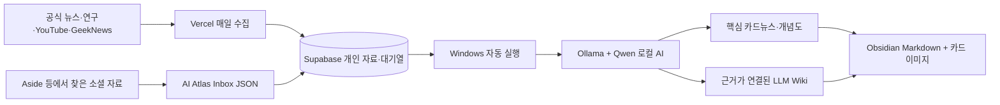

# AI Atlas 무료 자동화 운영 · 2026-09-18

사이트: https://ai-atlas-two.vercel.app

## 적용한 흐름



웹 수집은 PC 전원이 꺼져도 실행됩니다. 로컬 분석과 폴더 저장은 이 PC가 켜져 있고 Windows에 로그인한 동안 실행됩니다. 잠자기·종료 중에는 요청을 보관합니다. 홈페이지를 열어 둘 필요는 없습니다. CPU로 처리하므로 교육자료 한 건은 몇 분 이상 걸릴 수 있습니다.

기본값 `AI_PROVIDER=local`은 외부 유료 AI 호출을 차단합니다. OpenAI/Gateway 키가 있더라도 자동으로 사용하지 않습니다. API 사용료 없이 실행하며 PC 전기·메모리·저장공간은 사용합니다. Vercel/Supabase에는 기존 계정의 요금제와 사용 한도가 적용되며, 계정 요금제를 자동 변경하지 않습니다.

## 점검에서 발견해 수정한 불편

| 기존 문제                                                | 개선                                                                 |
| -------------------------------------------------------- | -------------------------------------------------------------------- |
| AI가 연결됐다고 표시되지만 Gateway 결제 설정 때문에 실패 | 무료 로컬 모델, 실제 PC 연결 표시, 유료 전환 차단                    |
| 긴 요청이 끝날 때까지 브라우저를 열어 둬야 함            | 저장된 대기열, 중복 방지, 완료 자동 갱신                             |
| 긴 로컬 응답이 5분에 끊김                                | 스트리밍 수신, 20분 상한, 결과 형식 검증                             |
| 실패한 이유·다시 시도할 곳이 불명확                      | 작업 이력, 최대 3회 자동 시도, 수동 재시도                           |
| RSS 제목·요약만 학습에 사용                              | 공개 기사 본문 추출, 실패 시 요약이라는 한계 유지                    |
| Obsidian 내보내기가 매번 수동                            | 자동 저장, 직접 수정한 파일 보호, 원문 이력 보존                     |
| 카드뉴스 이미지를 한 장씩 저장                           | Obsidian에 SVG 카드 이미지와 Markdown 함께 자동 보관                 |
| SNS·기사 URL을 복사해 앱을 다시 찾아야 함                | 공유 입력 화면, PC 북마크 수집 코드, 설치용 웹앱 설정                |
| 자동 정리를 끄기 어려움                                  | 홈페이지 자동화 패널의 일시 중지·이어하기                            |
| RAG 검색에 paragraph 같은 무관한 단어가 포함             | RAG·LLM·MCP 약어를 단어 경계로 검색하며 한글 조사 허용               |
| 분석 후 제목 변경을 Obsidian 사용자 편집 충돌로 오인     | 변경하지 않은 과거 원문은 그대로 보존하고 실제 직접 편집만 충돌 표시 |

소형 로컬 모델은 생성된 JSON 형식이 맞아도 설명을 틀릴 수 있습니다. 실제 검수에서 비교표 열 제목과 원문에 없는 제품 사양 예시를 보정했습니다. 생성 지침에 가상 사례 표시와 비교 대상 열 규칙을 추가했으며, 이것이 자동 사실 검증을 보장하지는 않습니다. 중요한 내용은 연결된 원문과 함께 확인하세요.

브라우저별 홈 화면 설치·공유 지원은 다릅니다. Android의 지원 브라우저에서 설치한 앱이 공유 대상으로 나타납니다. iPhone에서는 홈 화면 바로가기와 링크 붙여넣기를 사용합니다. 입력 화면을 연 것만으로 저장하거나 분석하지 않습니다.

## 무료 도구 비교와 선택

| 도구                                                                                      | 무료·라이선스와 현실적인 조건                                                     | 이번 적용                                                                            |
| ----------------------------------------------------------------------------------------- | --------------------------------------------------------------------------------- | ------------------------------------------------------------------------------------ |
| [Ollama](https://github.com/ollama/ollama), [Qwen3.5](https://ollama.com/library/qwen3.5) | Ollama MIT, Qwen 공개 모델. PC 계산 자원 필요. 4B 모델 약 3.4GB                   | 설치 및 로컬 추론 연결                                                               |
| [Mozilla Readability](https://github.com/mozilla/readability)                             | Apache 2.0. Firefox 읽기 모드의 본문 추출 엔진                                    | 공개 기사 본문 추출에 적용                                                           |
| [Aside Free](https://aside.com/pricing)                                                   | 월 500크레딧, 활성 루틴 3개. 오픈소스로 확인되지 않음. 모델·구독별 추가 조건 있음 | 아래 루틴 지시문과 JSON 수집 연결 준비                                               |
| [Browser Use](https://github.com/browser-use/browser-use)                                 | 로컬 라이브러리 MIT. 모델 계산 또는 API 비용 별도, 호스팅은 유료                  | 로그인 기반 소셜 수집을 확대할 때 후보                                               |
| [Activepieces Community](https://github.com/activepieces/activepieces)                    | 커뮤니티 MIT, 기업 기능은 별도 상용 라이선스. 직접 운영할 서버 필요               | 지금은 기존 Windows 실행기로 대체; 시각적 워크플로 편집이 필요해지면 후보            |
| [n8n](https://docs.n8n.io/sustainable-use-license/)                                       | 소스 공개지만 Sustainable Use License; 무제한 OSS라고 간주하면 안 됨              | 라이선스·운영 부담을 늘리지 않도록 미설치                                            |
| [Cloudflare Workers AI](https://developers.cloudflare.com/workers-ai/platform/pricing/)   | 무료 플랜 하루 10,000 Neurons, 한도 초과 오류. 일부 모델은 결제 수단 필요         | PC 없이 분석할 후속 대안. 계정 연결 없이 활성화됐다고 표시하지 않음                  |
| [Groq](https://console.groq.com/docs/rate-limits)                                         | 계정·모델별 무료 호출 한도, API 키 필요                                           | 선택적 클라우드 대안. 유료 전환 없는 별도 연결이 필요                                |
| [yt-dlp](https://github.com/yt-dlp/yt-dlp)                                                | 공개 영상·자막 수집 도구. 접근 제한·플랫폼 정책의 영향                            | 현재 공개 자막 수집이 불가능한 영상은 본문 추가를 안내. 로그인 제한 우회는 하지 않음 |

운영 판단: 현재 규모에서는 여러 자동화 서버를 중복 설치하는 것보다 `기존 웹 서버 + 개인 DB + 로컬 AI 작업기`가 관리 지점과 비용을 줄입니다. 위 표의 미설치 항목은 적용 완료로 취급하지 않습니다.

## Aside 연결 범위

이 PC에서는 Windows Aside CLI와 브라우저 프로필 u0를 사용합니다. Hermes의 `AI Atlas Daily Collection`이 매일 새벽 1시에 실행되며, Instagram 3건·Threads 3건·YouTube 4건 이내로 읽습니다. Instagram·Threads는 공개 검색 결과에서 게시물로 이동해 표시되는 본문을 수집하고, 댓글·검색 미리보기·로그인 화면을 본문으로 저장하지 않습니다. 플랫폼 전체 인기 순위나 이미지 분석은 제공하지 않습니다.

Aside에서 두 사이트에 최초 로그인하면 저장된 세션을 자동 재사용합니다. 비밀번호·쿠키를 파일로 추출하지 않습니다. 로그인 만료는 `login_required`, 추가 인증은 `challenge`, 본문 파싱 실패는 `unreadable` 등으로 보고합니다. 재시도를 포함한 Aside 저장량은 하루 10건이며, 중복 URL을 제외합니다. Vercel RSS 수집은 별도 경로이므로 이 한도에 포함되지 않습니다.

`atlas_collect_aside({})`는 세 플랫폼을 실행하고, `atlas_collect_aside({"post_url":"공개 게시물 URL"})`은 지정한 Instagram·Threads 게시물 하나를 읽습니다. 작업 결과는 `.local/social-capture-status.json`에도 남깁니다. 수집 잠금 파일은 동시 실행을 막으며 프로세스가 비정상 종료돼 남았을 때에는 실행 중 프로세스를 확인한 뒤 복구해야 합니다.

홈페이지의 `자동화 상태 → 지금 새 자료 가져오기`에서는 전체·Instagram DM·YouTube·Threads 리포스트를 직접 실행할 수 있습니다. 클릭하면 Supabase 작업함에 요청을 보관하고, 로그인된 Windows 작업기가 개인 소셜 신규 항목과 YouTube 검색을 확인한 뒤 같은 화면에 새 자료 제목·원문 링크·이미 확인한 항목 수를 표시합니다. YouTube 직접 실행은 회당 최대 4건이며 예약 수집의 일일 10건 한도에는 합산하지 않습니다. DM과 리포스트는 전체 목록을 순회하지만 체크포인트와 URL 중복 기록으로 신규 항목만 저장합니다.

검증(2026-09-18): 사용자가 Aside 브라우저에서 두 사이트에 로그인한 뒤 기존 세션을 재사용해 Instagram 1건·Threads 3건을 추가로 수집함에 저장했습니다. 로그인한 Instagram의 이미지 영역과 본문 영역을 구분하고, Threads가 홈 피드로 이동시키는 경우 첫 게시물의 날짜 링크에서 실제 출처 주소를 확인합니다. 짧은 캡션만 읽힌 Instagram 후보 1건은 저장하지 않았습니다. 이날 기존 자료를 포함한 Aside 저장량은 9건이며, 새 자료의 AI 분석 완료와는 별도의 수집 검증입니다. 로그인 만료 시에는 재로그인이 필요합니다.

### 루틴 1 · 매일 AI 실용 팁 수집

공개 YouTube·Instagram·Threads에서 최근 일주일의 AI 업무 활용 팁을 찾아라. 공식 자료를 먼저 확인하고, 실제로 확인한 조회수·좋아요·댓글 수만 기록하라. 관측 시간도 남겨라. 단순 광고·출처 불명 성능 숫자·재업로드 중복을 제외하고 최대 5개를 선택하라. 자막 또는 게시물 본문을 읽을 수 있을 때만 text에 넣고, 접근하지 못한 내용은 비워라. 로그인·결제·댓글 작성·메시지 전송은 하지 마라. 결과를 `AI Atlas Inbox` 폴더에 아래 JSON 형식으로 새 파일로 저장하라. 기존 파일은 수정하지 마라.

### 루틴 2 · 매주 카드뉴스 표현 연구

AI 교육 분야에서 실제 반응을 확인할 수 있는 공개 카드뉴스·영상 5개를 살펴보라. 원문이나 브랜드 디자인을 복제하지 말고, 한 장의 메시지 수·도입 질문·개념 설명·예시·마지막 복습 질문의 구성을 분석하라. 관측한 반응 수와 URL을 붙이고, 보이지 않는 지표는 추정하지 마라. 배울 수 있는 표현 원칙을 text에 기록하여 수집 폴더에 저장하라.

### 루틴 3 · 매주 오래된 지식 확인

저장된 AI 도구 안내에서 가격·지원 기능·모델 이름이 바뀔 수 있는 항목을 공식 문서와 비교하라. 확인된 변경과 미확인을 구분하고, 기존 원문이나 직접 작성한 노트를 덮어쓰지 마라. 수정 제안을 새 수집 자료로 저장하라. 기존 지식을 자동 삭제하지 마라.

### 자동 수집함 형식

이 PC 경로: `C:\Users\c\OneDrive\문서\AI Atlas Inbox`

```json
{
  "items": [
    {
      "title": "자료의 실제 제목",
      "url": "https://공개된-출처-주소",
      "text": "실제로 확인한 본문이나 자막. 접근할 수 없으면 빈 문자열",
      "observed_at": "2026-09-18T09:00:00+09:00",
      "metrics": { "views": 1234 }
    }
  ]
}
```

`observed_at`, `metrics`는 선택 사항입니다. 예시 숫자를 실제 수치처럼 사용하지 마세요. JSON 한 파일 최대 20개·1MB, 자료 본문 최대 60,000자입니다. 새 파일은 다음 작업 주기에 가져오며, 성공한 파일은 `processed`에 보존합니다. 오류 파일은 그대로 두고 옆의 `.error.txt`에 확인 사항을 씁니다. URL이 같은 자료는 중복 생성하지 않고, 직접 입력한 기존 본문도 덮어쓰지 않습니다.

## 운영·복구

### 개인 DM·리포스트 증분 동기화

2026-09-18 사용자 정정으로 Instagram 저장함 수집을 **일반 DM 전체의 새 공유 링크 수집**으로 교체했습니다. `.local/personal-social.json`의 `instagram_mode`는 `dm`, 주소는 `https://www.instagram.com/direct/inbox/`입니다. Threads 리포스트와 기존 일정은 유지합니다.

`lib/instagram-dm.ts`는 최초 실행에서 과거 메시지를 기준점으로만 기록하고 저장하지 않습니다. 이후 마지막 메시지 경계 뒤의 항목만 읽습니다. `.local/instagram-dm-checkpoint.json`에는 대화 식별값과 메시지 비교용 SHA-256, 공개 게시물 URL만 저장합니다. 원문 메시지·상대방 이름은 Atlas 기록에 저장하지 않습니다. 비어 있는 수신함·새 메시지 없음은 정상이며, 로딩 실패·계정 불일치·읽기 경계 미확인은 완료로 간주하지 않습니다. 새 대화는 기준점 생성 이후부터 처리합니다.

실제 검증: DM 기준점 생성 시 저장 0건, 과거 첨부 파일 미수집. 새 메시지가 도착한 실제 상황의 저장 검증은 아직 하지 않았으며, 변경 감지·중복·해시 테스트로 보완합니다. 아래 저장함 검증은 DM 전환 이전의 이력입니다.

- Windows 작업 `AI Atlas Personal Saved Sync`: 매일 한국 시간 01:15, 현재 사용자 로그인 후 2분에도 실행. 당일 전체 조회 완료 이력이 있으면 로그인 보충 실행은 건너뜁니다. PC와 Aside 로그인 세션이 필요합니다.
- 실행 파일: `scripts/start-personal-social.ps1` → `scripts/sync-personal-social.ts`. 브라우저 조회·분류는 유료 LLM 호출 없이 처리합니다. 저장량 제한은 없으며, 기존 추천 수집의 하루 10건 기록에 합산하지 않습니다.
- `.local/personal-social.json`: 사용자별 Instagram/Threads 계정과 확인된 목록 주소. 비밀번호와 쿠키는 포함하지 않습니다. Git에서 제외됩니다.
- `.local/personal-social-state.json`: 계정·플랫폼·정규화 URL별 `saved`, `excluded`, `retry`. 항목 처리 후마다 저장하므로 중단 후에도 성공 자료를 재저장하지 않습니다. Inbox와 processed의 기존 자료도 확인합니다.
- `.local/personal-social-status.json`: 조회·추가·제외·중복·재시도 건수, 채널별 조회 완료 여부. 목록에서 더 이상 새 항목이 나타나지 않고 로딩 표시도 없는 상태를 연속 확인하여 끝을 판정합니다. 로딩이 멈추거나 인증이 필요한 경우에는 전체 조회 완료로 표시하지 않습니다.
- 잠금 파일은 실행 PID를 기록합니다. 해당 프로세스가 종료된 것이 확인된 경우에만 다음 실행이 이전 잠금을 복구합니다. 실행 중에는 중복 실행하지 않습니다.
- Instagram 관련성은 보수적인 텍스트 규칙으로 판정합니다. 미확인은 다음 회차에 재시도하며 이미지 전용 자료나 연속 스레드 전체 수집은 아직 지원하지 않습니다. 이전 저장글의 수정 반영·원본 삭제에 따른 동기 삭제는 하지 않습니다.
- 2026-09-18 검증: Threads 리포스트 6건 신규 저장, 같은 목록 재실행은 신규 0건·기존 6건. Instagram은 최종 확인 시 빈 저장함으로 표시되었습니다. Windows 예약 작업 시험 실행은 종료 코드 0, 다음 예약은 2026-09-19 01:15입니다.

- Windows 작업 스케줄러: `AI Atlas Free Automation`, 현재 사용자 로그인 시 실행.
- 로컬 AI 주소: `http://127.0.0.1:11434`, 인터넷에 공개하지 않음.
- 연결 방향: PC → Supabase HTTPS. 홈페이지가 PC 포트로 직접 접속하지 않음.
- 비밀키: Git에 포함되지 않는 `.env.local`만 사용. 수집 도구나 Aside에 DB 키를 주지 않음.
- 로컬 설정: `.local/worker.env`, 실행 기록: `.local/worker.log`.
- 시작: `scripts/start-worker.ps1`. 중복 실행은 차단.
- 일시 중지: 홈페이지 상단 자동화 상태를 펼치고 `자동 정리 잠시 멈춤`. 진행 중인 한 작업은 마친 뒤 멈춤.
- Obsidian: `C:\Users\c\OneDrive\문서\AI Atlas Second Brain`을 보관함으로 열기.
- 직접 편집은 `personal/` 권장. 변경 충돌은 원본 파일을 보존하고 홈페이지에 개수를 표시.
- 동기화는 웹 → Obsidian 방향. Obsidian의 직접 편집 내용을 서버로 자동 덮어쓰지 않음.
- 모델 응답은 AI 초안이며 원문 인용·검토 쟁점을 함께 보관. 도구가 실제 읽은 범위와 확인하지 못한 지표를 구분.

## 실제 확인한 범위

- 운영 사이트에서 로그인·자료 저장·개인별 접근 제한·분석 대기열·재시도 API를 확인했습니다.
- 2026-09-18 소식 3개와 카드 12장, 연결된 Wiki 문서 2개 이상, 무료 로컬 모델로 생성한 상세 학습 노트를 실제 DB에 저장했습니다.
- Obsidian 폴더와 ZIP 내보내기에서 Markdown 및 카드 이미지 12장을 확인했습니다.
- 자동화 핵심 테스트 5개와 전체 테스트 14개, TypeScript 및 프로덕션 빌드를 통과했습니다.
- Aside의 YouTube 수집과 로그인 세션을 재사용한 Instagram·Threads 본문 읽기·저장을 확인했습니다. 플랫폼 전체 인기 수집, 이미지·영상 자체의 내용 분석, 모든 기종의 설치·공유는 검증 범위에 포함되지 않습니다.

## 후속 개선 순서

1. 무료 클라우드 계정 연결 시 PC 없이 분석하는 옵션: 무료 한도 도달 시 대기, 유료 자동 전환 금지.
2. 공개 자막이 없는 본인 소유·허용 영상에 로컬 음성 인식 추가.
3. 자료가 수천 건 이상 쌓이면 무료 로컬 임베딩으로 의미 검색과 변경 영향 추적 개선.
4. 여러 사용자가 쓰는 서비스로 확대할 때 전용 DB 프로젝트·독립 작업기·운영 지표·백업 복구 훈련 추가.

개인용으로 검증한 구성이므로, 다른 사용자가 가입하면 로컬 AI를 무제한 공유하는 공개 서비스로 자동 확대되지 않습니다. 허용 계정만 분석 작업을 등록할 수 있습니다.
