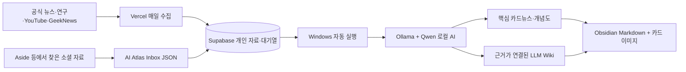

# AI Atlas 무료 자동화 운영 · 2026-09-18

사이트: https://ai-atlas-two.vercel.app

## 적용한 흐름



웹 수집은 PC 전원이 꺼져도 실행됩니다. 로컬 분석과 폴더 저장은 이 PC가 켜져 있고 Windows에 로그인한 동안 실행됩니다. 잠자기·종료 중에는 요청을 보관합니다. 홈페이지를 열어 둘 필요는 없습니다. CPU로 처리하므로 교육자료 한 건은 몇 분 이상 걸릴 수 있습니다.

기본값 `AI_PROVIDER=local`은 외부 유료 AI 호출을 차단합니다. OpenAI/Gateway 키가 있더라도 자동으로 사용하지 않습니다. API 사용료 없이 실행하며 PC 전기·메모리·저장공간은 사용합니다. Vercel/Supabase는 기존 계정의 무료 한도 안에서 운영하며, 계정 요금제를 자동 변경하지 않습니다.

## 점검에서 발견해 수정한 불편

| 기존 문제 | 개선 |
|---|---|
| AI가 연결됐다고 표시되지만 Gateway 결제 설정 때문에 실패 | 무료 로컬 모델, 실제 PC 연결 표시, 유료 전환 차단 |
| 긴 요청이 끝날 때까지 브라우저를 열어 둬야 함 | 저장된 대기열, 중복 방지, 완료 자동 갱신 |
| 긴 로컬 응답이 5분에 끊김 | 스트리밍 수신, 20분 상한, 결과 형식 검증 |
| 실패한 이유·다시 시도할 곳이 불명확 | 작업 이력, 최대 3회 자동 시도, 수동 재시도 |
| RSS 제목·요약만 학습에 사용 | 공개 기사 본문 추출, 실패 시 요약이라는 한계 유지 |
| Obsidian 내보내기가 매번 수동 | 자동 저장, 직접 수정한 파일 보호, 원문 이력 보존 |
| 카드뉴스 이미지를 한 장씩 저장 | Obsidian에 SVG 카드 이미지와 Markdown 함께 자동 보관 |
| SNS·기사 URL을 복사해 앱을 다시 찾아야 함 | 공유 입력 화면, PC 북마크 수집 코드, 설치용 웹앱 설정 |
| 자동 정리를 끄기 어려움 | 홈페이지 자동화 패널의 일시 중지·이어하기 |

브라우저별 홈 화면 설치·공유 지원은 다릅니다. Android의 지원 브라우저에서 설치한 앱이 공유 대상으로 나타납니다. iPhone에서는 홈 화면 바로가기와 링크 붙여넣기를 사용합니다. 입력 화면을 연 것만으로 저장하거나 분석하지 않습니다.

## 무료 도구 비교와 선택

| 도구 | 무료·라이선스와 현실적인 조건 | 이번 적용 |
|---|---|---|
| [Ollama](https://github.com/ollama/ollama), [Qwen3.5](https://ollama.com/library/qwen3.5) | Ollama MIT, Qwen 공개 모델. PC 계산 자원 필요. 4B 모델 약 3.4GB | 설치 및 로컬 추론 연결 |
| [Mozilla Readability](https://github.com/mozilla/readability) | Apache 2.0. Firefox 읽기 모드의 본문 추출 엔진 | 공개 기사 본문 추출에 적용 |
| [Aside Free](https://aside.com/pricing) | 월 500크레딧, 활성 루틴 3개. 오픈소스로 확인되지 않음. 모델·구독별 추가 조건 있음 | 아래 루틴 지시문과 JSON 수집 연결 준비 |
| [Browser Use](https://github.com/browser-use/browser-use) | 로컬 라이브러리 MIT. 모델 계산 또는 API 비용 별도, 호스팅은 유료 | 로그인 기반 소셜 수집을 확대할 때 후보 |
| [Activepieces Community](https://github.com/activepieces/activepieces) | 커뮤니티 MIT, 기업 기능은 별도 상용 라이선스. 직접 운영할 서버 필요 | 지금은 기존 Windows 실행기로 대체; 시각적 워크플로 편집이 필요해지면 후보 |
| [n8n](https://docs.n8n.io/sustainable-use-license/) | 소스 공개지만 Sustainable Use License; 무제한 OSS라고 간주하면 안 됨 | 라이선스·운영 부담을 늘리지 않도록 미설치 |
| [Cloudflare Workers AI](https://developers.cloudflare.com/workers-ai/platform/pricing/) | 무료 플랜 하루 10,000 Neurons, 한도 초과 오류. 일부 모델은 결제 수단 필요 | PC 없이 분석할 후속 대안. 계정 연결 없이 활성화됐다고 표시하지 않음 |
| [Groq](https://console.groq.com/docs/rate-limits) | 계정·모델별 무료 호출 한도, API 키 필요 | 선택적 클라우드 대안. 유료 전환 없는 별도 연결이 필요 |
| [yt-dlp](https://github.com/yt-dlp/yt-dlp) | 공개 영상·자막 수집 도구. 접근 제한·플랫폼 정책의 영향 | 현재 공개 자막 수집이 불가능한 영상은 본문 추가를 안내. 로그인 제한 우회는 하지 않음 |

운영 판단: 현재 규모에서는 여러 자동화 서버를 중복 설치하는 것보다 `기존 웹 서버 + 개인 DB + 로컬 AI 작업기`가 관리 지점과 비용을 줄입니다. 위 표의 미설치 항목은 적용 완료로 취급하지 않습니다.

## Aside 연결 범위

[공식 시작 문서](https://docs.aside.com/help/get-started)는 macOS 15 이상을 안내하고, [공개 다운로드](https://aside.com/download)도 DMG 설치를 안내합니다. 반면 [개발자 문서](https://docs.aside.com/help/developers)에는 Windows CLI가 있습니다. 이 PC에 로그인된 Aside 브라우저가 없어 실제 Aside 루틴은 활성화하지 않았습니다. 무료 플랜에서 가능한 세 루틴을 준비했으며, Aside 사용 환경이 갖춰지면 해당 지시문으로 실행할 수 있습니다. 현재 공식 RSS 자동 수집은 Aside와 관계없이 작동합니다.

### 루틴 1 · 매일 AI 실용 팁 수집

공개 YouTube·Instagram·Threads에서 최근 일주일의 AI 업무 활용 팁을 찾아라. 공식 자료를 먼저 확인하고, 실제로 확인한 조회수·좋아요·댓글 수만 기록하라. 관측 시간도 남겨라. 단순 광고·출처 불명 성능 숫자·재업로드 중복을 제외하고 최대 5개를 선택하라. 자막 또는 게시물 본문을 읽을 수 있을 때만 text에 넣고, 접근하지 못한 내용은 비워라. 로그인·결제·댓글 작성·메시지 전송은 하지 마라. 결과를 `AI Atlas Inbox` 폴더에 아래 JSON 형식으로 새 파일로 저장하라. 기존 파일은 수정하지 마라.

### 루틴 2 · 매주 카드뉴스 표현 연구

AI 교육 분야에서 실제 반응을 확인할 수 있는 공개 카드뉴스·영상 5개를 살펴보라. 원문이나 브랜드 디자인을 복제하지 말고, 한 장의 메시지 수·도입 질문·개념 설명·예시·마지막 복습 질문의 구성을 분석하라. 관측한 반응 수와 URL을 붙이고, 보이지 않는 지표는 추정하지 마라. 배울 수 있는 표현 원칙을 text에 기록하여 수집 폴더에 저장하라.

### 루틴 3 · 매주 오래된 지식 확인

저장된 AI 도구 안내에서 가격·지원 기능·모델 이름이 바뀔 수 있는 항목을 공식 문서와 비교하라. 확인된 변경과 미확인을 구분하고, 기존 원문이나 직접 작성한 노트를 덮어쓰지 마라. 수정 제안을 새 수집 자료로 저장하라. 기존 지식을 자동 삭제하지 마라.

### 자동 수집함 형식

이 PC 경로: `C:\Users\c\OneDrive\문서\AI Atlas Inbox`

```json
{
  "items": [
    {
      "title": "자료의 실제 제목",
      "url": "https://공개된-출처-주소",
      "text": "실제로 확인한 본문이나 자막. 접근할 수 없으면 빈 문자열",
      "observed_at": "2026-09-18T09:00:00+09:00",
      "metrics": { "views": 1234 }
    }
  ]
}
```

`observed_at`, `metrics`는 선택 사항입니다. 예시 숫자를 실제 수치처럼 사용하지 마세요. JSON 한 파일 최대 20개·1MB, 자료 본문 최대 60,000자입니다. 새 파일은 다음 작업 주기에 가져오며, 성공한 파일은 `processed`에 보존합니다. 오류 파일은 그대로 두고 옆의 `.error.txt`에 확인 사항을 씁니다. URL이 같은 자료는 중복 생성하지 않고, 직접 입력한 기존 본문도 덮어쓰지 않습니다.

## 운영·복구

- Windows 작업 스케줄러: `AI Atlas Free Automation`, 현재 사용자 로그인 시 실행.
- 로컬 AI 주소: `http://127.0.0.1:11434`, 인터넷에 공개하지 않음.
- 연결 방향: PC → Supabase HTTPS. 홈페이지가 PC 포트로 직접 접속하지 않음.
- 비밀키: Git에 포함되지 않는 `.env.local`만 사용. 수집 도구나 Aside에 DB 키를 주지 않음.
- 로컬 설정: `.local/worker.env`, 실행 기록: `.local/worker.log`.
- 시작: `scripts/start-worker.ps1`. 중복 실행은 차단.
- 일시 중지: 홈페이지 상단 자동화 상태를 펼치고 `자동 정리 잠시 멈춤`. 진행 중인 한 작업은 마친 뒤 멈춤.
- Obsidian: `C:\Users\c\OneDrive\문서\AI Atlas Second Brain`을 보관함으로 열기.
- 직접 편집은 `personal/` 권장. 변경 충돌은 원본 파일을 보존하고 홈페이지에 개수를 표시.
- 동기화는 웹 → Obsidian 방향. Obsidian의 직접 편집 내용을 서버로 자동 덮어쓰지 않음.
- 모델 응답은 AI 초안이며 원문 인용·검토 쟁점을 함께 보관. 도구가 실제 읽은 범위와 확인하지 못한 지표를 구분.

## 후속 개선 순서

1. 무료 클라우드 계정 연결 시 PC 없이 분석하는 옵션: 무료 한도 도달 시 대기, 유료 자동 전환 금지.
2. 공개 자막이 없는 본인 소유·허용 영상에 로컬 음성 인식 추가.
3. 자료가 수천 건 이상 쌓이면 무료 로컬 임베딩으로 의미 검색과 변경 영향 추적 개선.
4. 여러 사용자가 쓰는 서비스로 확대할 때 전용 DB 프로젝트·독립 작업기·운영 지표·백업 복구 훈련 추가.

개인용으로 검증한 구성이므로, 다른 사용자가 가입하면 로컬 AI를 무제한 공유하는 공개 서비스로 자동 확대되지 않습니다. 허용 계정만 분석 작업을 등록할 수 있습니다.
