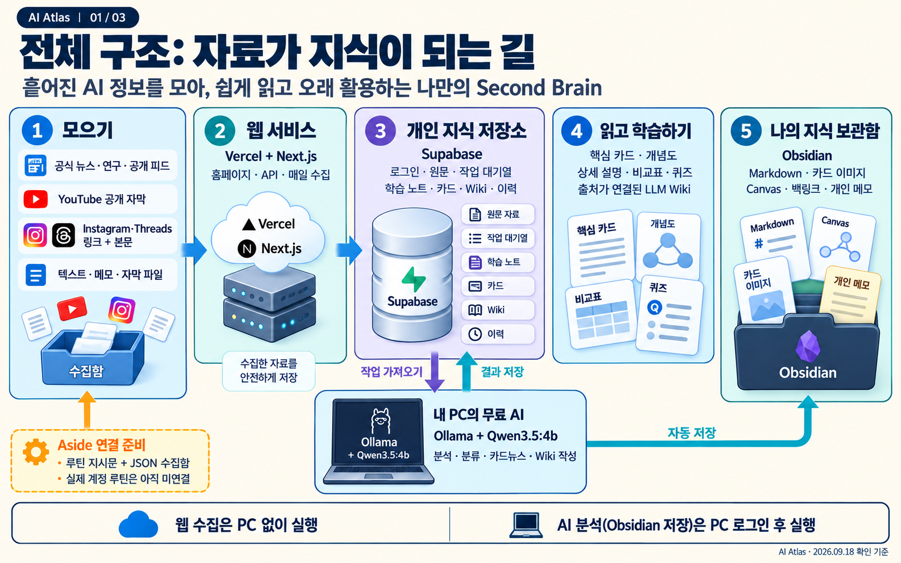
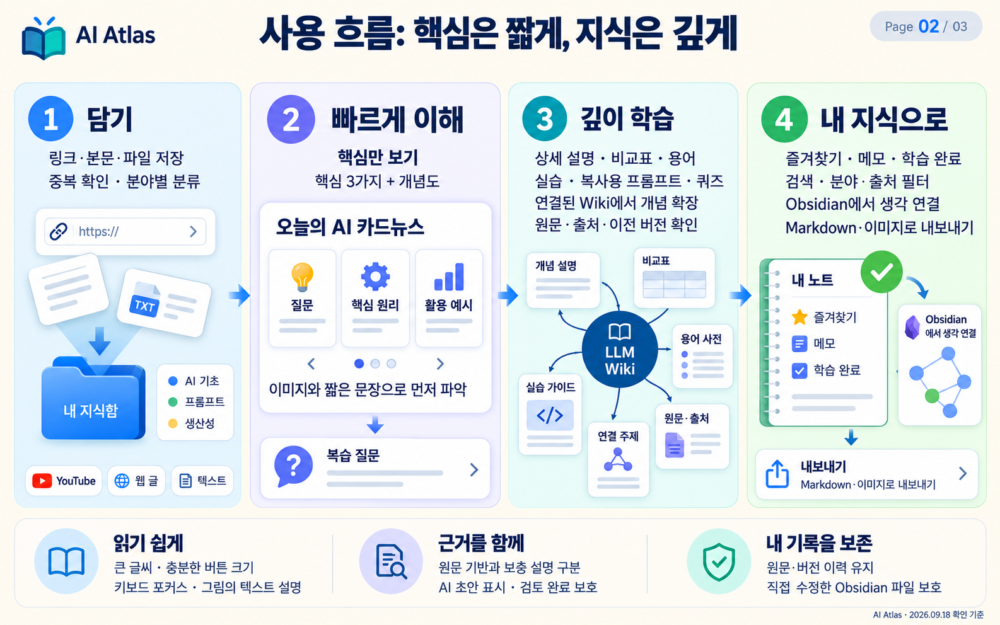
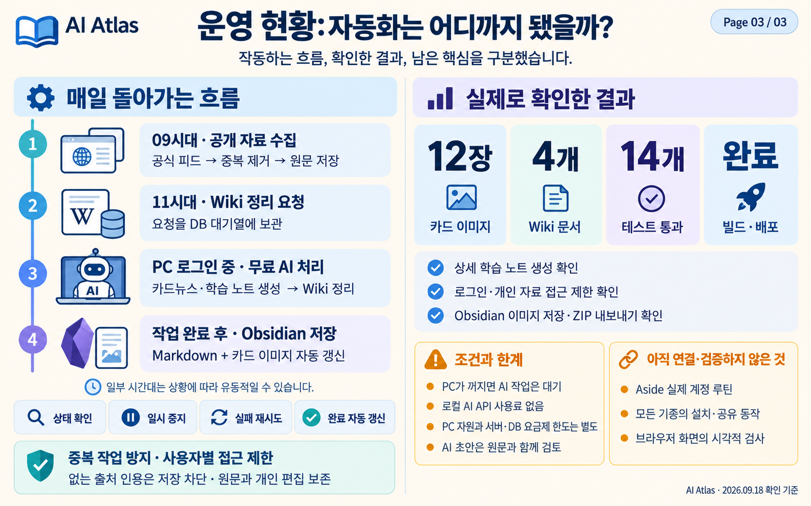

# AI Atlas — 서비스 큰그림

2026-09-18 확인 기준 · [운영 사이트](https://ai-atlas-two.vercel.app/)

이 자료는 실제로 구현한 서비스의 구조를 설명한 이미지입니다. 실제 홈페이지 화면을 촬영한 스크린샷은 아닙니다. 이미지와 수치는 이 문서를 만든 시점의 기록입니다.

## 1. 전체 구조: 자료가 지식이 되는 길

**수집 → 보관 → AI 정리 → 학습 → 지식 축적**이 전체 흐름입니다.

| 구성 | 맡은 역할 | 현재 상태 |
|---|---|---|
| Vercel + Next.js | 홈페이지, 서버 API, 정기 수집·작업 예약 | 배포됨 |
| Supabase | 로그인, 원문, 분석 요청 대기열, 생성 결과, Wiki 이력 | 연결됨 |
| 내 PC의 Ollama + Qwen3.5:4b | 분류, 학습 노트, 카드뉴스, Wiki 생성 | 로컬 실행기 설치·예약 실행 |
| Obsidian 보관함 | Markdown, 카드 SVG, 연결 지도, 개인 메모 보관 | 파일 자동 저장 연결 |
| Aside | 소셜 자료 수집과 표현 연구 자동화 후보 | 지시문·JSON 연결 준비, 실제 계정 루틴 미연결 |

홈페이지에서 요청하면 Supabase에 대기 작업이 저장됩니다. PC 작업기가 요청을 가져와 처리하고 결과를 DB에 돌려줍니다. 웹은 그 결과를 표시합니다. 같은 작업기가 Obsidian 보관함도 갱신합니다. 홈페이지가 PC의 AI 포트에 직접 접속하는 구조는 아닙니다.

## 2. 사용 흐름: 핵심은 짧게, 지식은 깊게

- **자료 담기:** URL·본문·TXT·MD·SRT·VTT 파일. 웹 글은 공개 본문 추출, YouTube는 공개 자막 수집을 시도합니다. Instagram·Threads는 링크와 본문을 함께 넣습니다.
- **빠르게 이해:** 핵심 3가지, 자료별 개념도, 짧은 카드뉴스를 먼저 보여 줍니다. 상세 내용은 필요할 때 펼칩니다.
- **깊이 학습:** 목표, 설명과 예시, 비교표, 용어, 실습, 복사용 프롬프트, 복습 퀴즈를 제공합니다.
- **Wiki로 연결:** 저장 자료를 근거로 개념·도구·가이드·질문 답변을 작성합니다. 출처와 관련 문서, 이전 버전을 연결하고 검토 완료 문서는 자동 수정에서 보호합니다.
- **내 지식으로 축적:** 검색, 분야·출처 필터, 즐겨찾기, 학습 완료, 개인 메모, 휴지통·복원을 제공합니다. 개별 자료·Wiki 주소를 북마크할 수 있습니다.

분야는 AI 기초, 프롬프트, AI 에이전트, 개발·자동화, 이미지·영상, 생산성, 산업·트렌드의 7개입니다. 그림의 분류 상자는 그중 일부 예시입니다.

접근성을 위해 기본 본문·입력창 16px, 주요 버튼 높이 44px 이상, 키보드 포커스, 그림의 텍스트 설명, 동작 줄이기 대응을 구현했습니다. 다양한 기기에서의 실제 화면 검사는 별도 검증 범위입니다.

LLM Wiki는 저장된 자료를 AI가 연결·정리하는 지식 공간입니다. 개인 자료로 모델을 다시 학습시킨다는 뜻은 아닙니다. 별도 벡터 임베딩 기반 의미 검색은 후속 개선 항목입니다.

## 3. 자동화와 검증 현황

한국 시간 09시대에 공개 자료 수집, 11시대에 Wiki 정리를 예약합니다. 실제 실행 분은 보장하지 않습니다. 로컬 실행기는 놓친 당일 수집을 보완하고 카드·학습 노트가 완성되면 Wiki 작업도 이어서 예약합니다.

PC에 로그인한 동안 대기 작업을 처리합니다. 브라우저는 닫아도 됩니다. PC가 꺼지거나 잠들면 로컬 분석은 대기합니다. 홈페이지 상단에서 PC 연결, 작업 이력, 재시도, 일시 중지, 마지막 Obsidian 저장 상태를 확인할 수 있습니다.

Obsidian에는 작업 완료 후와 유휴 상태에서 약 15분마다 저장합니다. 웹 → 보관함 방향의 동기화이며, 보관함에서 직접 수정한 파일은 보호합니다. 원문 이력과 개인 메모를 보존하고 기존 파일을 자동 삭제하지 않습니다. Obsidian에서 직접 편집한 내용을 웹으로 되돌리는 양방향 동기화는 아닙니다.

### 실제 확인한 결과

| 확인 항목 | 결과 |
|---|---|
| 실제 AI 카드뉴스 | 소식 3개, 카드 이미지 12장 |
| 실제 Wiki | 문서 4개와 버전 이력 |
| 상세 학습 노트 | 무료 로컬 모델로 생성·저장 확인 |
| Obsidian / ZIP | 파일 36개, 카드 SVG 12장 확인 |
| 자동 테스트 | 14개 통과 |
| 배포 | TypeScript·프로덕션 빌드·Vercel 배포 통과 |
| 운영 API | 로그인, 익명 접근 차단, 개인별 데이터 접근, 자동화 상태 확인 |
| 검색 | RAG 검색에서 paragraph 같은 무관한 부분 일치 제외 |

테스트에는 DB 접근 격리, 중복 방지, 작업 점유·복구, 사용량 제한, 위험한 URL 차단, 스트리밍 한국어 처리, 카드 이미지 문자 처리, Obsidian 직접 편집 보호 등이 포함됩니다.

### 품질을 위해 보완한 부분

- 생성 결과를 구조에 맞춰 검증하고 비교표 열 수를 제한했습니다.
- 카드에 원문 출처와 실제 복습 질문을 연결했습니다.
- 원문에 없는 제품 사양 예시와 잘못된 비교표 제목을 검토·보정했습니다.
- Wiki에는 AI 초안 표시와 출처를 읽은 범위·검토 사항을 남깁니다.
- 모델이 실제 자료 중에서만 출처를 선택하도록 제한하고, 없는 출처가 있으면 저장하지 않습니다.
- 직접 수정한 Wiki의 버전이 바뀌면 오래된 AI 결과가 덮어쓰지 않도록 보호합니다.

이 검증이 AI 설명의 사실 정확도를 자동 보장하지는 않습니다. 중요한 정보는 연결된 원문과 함께 확인해야 합니다.

## 비용과 현재 범위

로컬 AI는 외부 유료 API를 호출하지 않으며 유료 모델로 자동 전환하지 않습니다. PC 전기·메모리·저장공간은 사용합니다. Vercel·Supabase에는 기존 계정의 요금제와 한도가 적용됩니다.

공식 공개 피드 자동 수집은 동작하지만, Instagram·Threads 전체 인기 게시물을 자동으로 수집하는 기능이나 로그인된 Aside 루틴은 아직 연결되지 않았습니다. 실제 소셜 반응 지표가 없으면 임의로 만들어 표시하지 않습니다.

영상의 음성·화면이나 Instagram 이미지 자체를 자동 분석하는 기능은 현재 없습니다. 서비스의 개념도·카드 이미지는 저장된 텍스트를 도표·SVG로 렌더링합니다. 이번 큰그림 3장은 별도로 내장 이미지 생성 도구로 제작한 설명 자료입니다.

전체 기종의 홈 화면 설치·공유, 브라우저 화면의 시각적 검사는 아직 확인하지 않은 범위입니다. 현재 구성은 허용된 개인 계정의 사용을 기준으로 합니다.

## 다음에 확장할 수 있는 것

1. Aside 계정 연결 후 준비한 수집·표현 연구·오래된 정보 점검 루틴 실제 실행.
2. 무료 클라우드 추론 계정이 준비되면 PC 없이 분석하는 선택지 검토.
3. 허용된 영상의 로컬 음성 인식, 자료가 늘어날 때 의미 검색 추가.
4. 여러 사용자 서비스로 확대할 때 별도 DB·작업기·운영 지표와 백업 복구 체계 검증.

위 항목은 계획이며 적용 완료된 기능이 아닙니다.

## 관련 파일

- [자세한 무료 자동화 운영 안내](../../AUTOMATION.md)
- [일반 사용 안내](../../../USER_GUIDE.md)
- [이미지 제작 프롬프트](PROMPTS.md)

이미지는 내장 image_gen으로 생성한 뒤 글자·배경·기능 표기를 검토·수정했습니다. 별도의 이미지 생성 API 키나 CLI는 사용하지 않았습니다.

